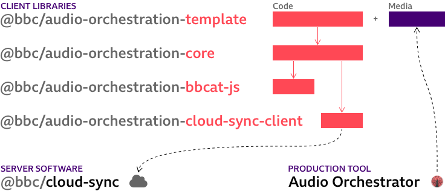

# Audio Orchestration

**Create immersive and interactive audio experiences for multiple synchronised devices.**

Audio device orchestration is the concept of using multiple connected devices to play back an audio experience. This repository holds an open source template application and libraries that handle the key components of an orchestrated audio system (pairing, synchronisation, and audio playback).

## Components



We provide a **template** application which can easily be extended to customise the user interface. It uses our **core** library for managing the connected devices, synchronisation, and audio rendering. This in turn uses our internal helper libraries: **bbcat-js** (audio streaming) and **cloud-sync-client** (connection to the synchronisation server).

The [**Cloud-Sync** server](https://github.com/2-IMMERSE/cloud-sync) source code is published separately on GitHub. To use the template and examples in this repository, you will need to set up a Cloud-Sync server.

More detailed information about each of the packages is available in the respective Readme files.

* [`@bbc/audio-orchestration-template`](packages/template)
* [`@bbc/audio-orchestration-core`](packages/core)
* [`@bbc/audio-orchestration-bbcat-js`](packages/bbcat-js)
* [`@bbc/audio-orchestration-cloud-sync-client`](packages/cloud-sync-client)

## The _Audio Orchestrator_ production tool

Our _Audio Orchestrator_ production tool for authoring metadata and packaging media for use with the template and core library is [freely available on request from BBC MakerBox](https://www.bbc.co.uk/makerbox/tools/audio-orchestrator).

The [_Audio Orchestrator_ documentation](https://bbc.github.io/bbcat-orchestration-docs/) includes a [list of experiences made with these tools](https://bbc.github.io/bbcat-orchestration-docs/productions/) and [instructions for using a custom template](https://bbc.github.io/bbcat-orchestration-docs/custom-template) built using this repository.

# Usage

Ensure you have [Node.js](https://nodejs.org/en/) installed, including `npm` version 7 or higher (earlier versions of `npm` do not have the workspaces functionality used in this repository).

```
node -v # e.g. v16.13.0
npm -v # e.g. 8.1.0
```

Start your project by downloading a copy of this repository, either by using the `Download as ZIP` button on GitHub, or by using `degit`.

```
mkdir my-project
cd my-project
npx degit bbc/audio-orchestration
```

Install the dependencies, then build all the packages once (the `-ws` flag tells `npm` to run the `build` command for each package).

```sh
npm install
npm run build -ws
```

Then you can, for example, start a development server for the template, which will use the other packages you've just built.

```sh
cd packages/template
npm run dev
```

Note that you will have to set up a cloud-sync server and add its address to the template's `index.html` configuration before you can connect devices. See the [template documentation](./packages/template/Readme.md) for more information.

# Advanced usage

If needed, you can also install our pre-built packages by specifying the GitHub Package Registry for the `@bbc` scope in an `.npmrc` file for your project.

```sh
echo "@bbc:registry=https://npm.pkg.github.com" >> .npmrc
npm add @bbc/audio-orchestration-core
```

# License

The majority of our components (`template`, `core`, and `bbcat-js`) are licensed under the GPLv3 license. The `cloud-sync-client` is licensed under an Apache 2.0 license. See the LICENSE file in each package directory for the specific licensing terms and copyright information.

If you are modifying the software to create your experience you may have to make your source code modifications available under the terms of the GPL license.

You may [contact BBC R&D](https://www.bbc.co.uk/rd/contacts) to discuss alternative licensing options. (Please note, the BBC is under no obligation to offer alternative terms.)

# Contributing

Please contact the authors by [raising a GitHub issue](https://github.com/bbc/audio-orchestration/issues/new) or pull request if you would like to contribute to this repository. A contributor licence agreement may be applicable.
