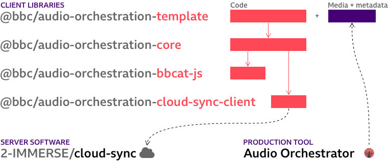

# Audio Orchestration

**Create immersive and interactive audio experiences for multiple synchronised devices.**

Audio device orchestration is the concept of using multiple connected devices to play back an audio experience. This repository holds a template application and libraries that handle the key components of an orchestrated audio system (pairing, synchronisation, and audio playback).

## The _Audio Orchestrator_ production tool

Our _Audio Orchestrator_ production tool is now available through the open-source [Audio Orchestrator repository](https://github.com/bbc/audio-orchestrator). This tool is used for authoring metadata, and packaging media for use with the template and core library.

The [_Audio Orchestrator_ documentation](https://bbc.github.io/audio-orchestrator/) includes a [list of experiences made with these tools](https://bbc.github.io/audio-orchestrator/productions/) and [instructions for using a custom template](https://bbc.github.io/audio-orchestrator/custom-template) built using this repository. Note that most BBC productions shown there received significant additional development to extend the default template.

## Components



We provide a **template** application which can easily be extended to customise the user interface. It uses our **core** library for managing the connected devices, synchronisation, and audio rendering. This in turn uses our internal helper libraries: **bbcat-js** (audio streaming) and **cloud-sync-client** (connection to the synchronisation server).

The [**Cloud-Sync** server](https://github.com/2-IMMERSE/cloud-sync) source code is published separately on GitHub. You can start working with the template using the experimental peerJS synchronisation adapter, but you may want to set up a Cloud-Sync server for production use. Further information on switching synchronisation backends can be found in the [template Readme](packages/template/Readme.md) file.

* [`@bbc/audio-orchestration-template`](packages/template)
* [`@bbc/audio-orchestration-core`](packages/core)
* [`@bbc/audio-orchestration-bbcat-js`](packages/bbcat-js)
* [`@bbc/audio-orchestration-cloud-sync-client`](packages/cloud-sync-client)

# Usage

Ensure you have [Node.js](https://nodejs.org/en/) installed, with a recent version of NPM.

```
node -v # e.g. v20.9.0
npm -v # e.g. 10.4.0
```

Start your project by downloading a copy of this repository, either by using the `Download as ZIP` button on GitHub, or by using `degit`.

```
mkdir my-project
cd my-project
npx degit bbc/audio-orchestration
```

Install the dependencies, then build all the packages once (the `-ws` flag tells `npm` to run the `build` command for each package).

```sh
npm install
npm run build -ws
```

Then you can, for example, start a development server for the template, which will use the other packages you've just built.

```sh
cd packages/template
npm run dev
```

See the [template documentation](packages/template/Readme.md) for how to configure a Cloud-Sync server, if the experimental peer-to-peer synchronisation adapter does not meet your needs.

# Advanced usage

If you need to use the core library outside of a custom template based on this repositoy, you may also install our pre-built packages by specifying the GitHub Package Registry for the `@bbc` scope in an `.npmrc` file for your project.

```sh
echo "@bbc:registry=https://npm.pkg.github.com" >> .npmrc
npm add @bbc/audio-orchestration-core
```

# Licence

The majority of our components (`template`, `core`, and `bbcat-js`) are licensed under the GPLv3 license. The `cloud-sync-client` is licensed under the Apache 2.0 license. See the LICENSE file in each package directory for the specific licensing terms and copyright information.

If you are modifying the software to create your experience you may have to make your source code modifications available under the terms of the GPL license.

You may [contact BBC R&D](https://www.bbc.co.uk/rd/contacts) to discuss alternative licensing options. (Please note, the BBC is under no obligation to offer alternative terms.)