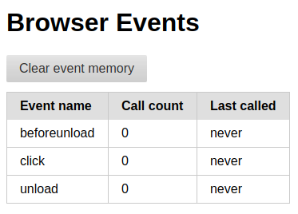
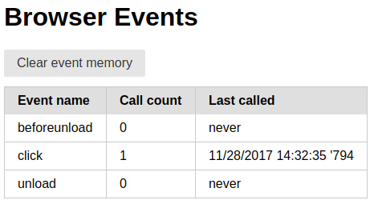
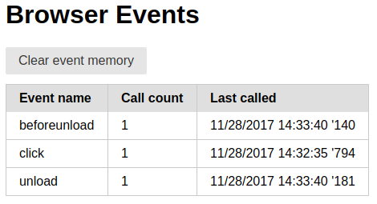
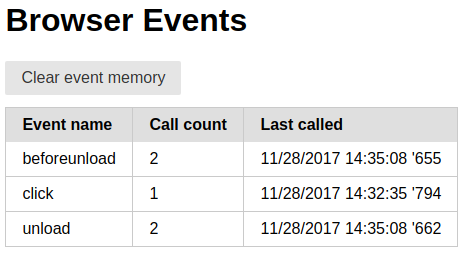

# What is this?
A simple application to test events being fired by the browsers ```window``` object. 

# Usage
Open [http://localhost:8446](http://localhost:8446) the browser you like to test.

## Overview

The application shows a table with following columns:
* **Event name**: shows the event which is observed by the test app.
* **Call count**: shows how often the event was called.
* **Last called**: shows time and date of when the event was called last.

The application currently listens for the following events:
* ```'unload'```: should be fired when the webpage is unload (e.g. when user requests reload or close of the current browser tab or window)
* ```'beforeunload'```: should be fired before the ```'unload'``` event.
* ```'click'```: should be fired when the webpage is clicked. Note: the "*Clear event memory*" button's click handler currently prevents propargation of the click event to ```window```. A click on this button will therefore not be counted.

## Typical test scenario

### 1. Load page
If you first load the test page on [http://localhost:8446](http://localhost:8446), it should look like this:



All counters are set to zero, as none of the events has ever been called.

### 2. Test event counter
Click somewhere on the page (except the "*Clear event memory*" button) to test whether counters work correctly. The value of "count" in row "click" should equal the amount of time you clicked. Also the date and time of your last click should be shown in column date.

The page should look like this:



### 3. Reload the page
The value of "count" in rows "beforeunload" and "unload" should be incremented by 1. Also the date of the last reload action should be shown both rows "beforeunload" and "unload".

The page should look like this:



### 4. Close the pages browser tab or window
The value of "count" in rows "beforeunload" and "unload" should be incremented by 1. Also the date of the last reload action should be shown both rows "beforeunload" and "unload".

The page should look like this:



### Reset counters
You can reset the table by clicking the "*Clear event memory*" button.


# Install and run

## Prerequisits
* NPM
* Grunt CLI

## Install
Change to the project directory:

```
cd [path/to]/examples/browserevents
```
Install project's NPM dependencies:

```
npm install
```

## Run
Build from source and serve at [http://localhost:8446](http://localhost:8446):

```
grunt
```