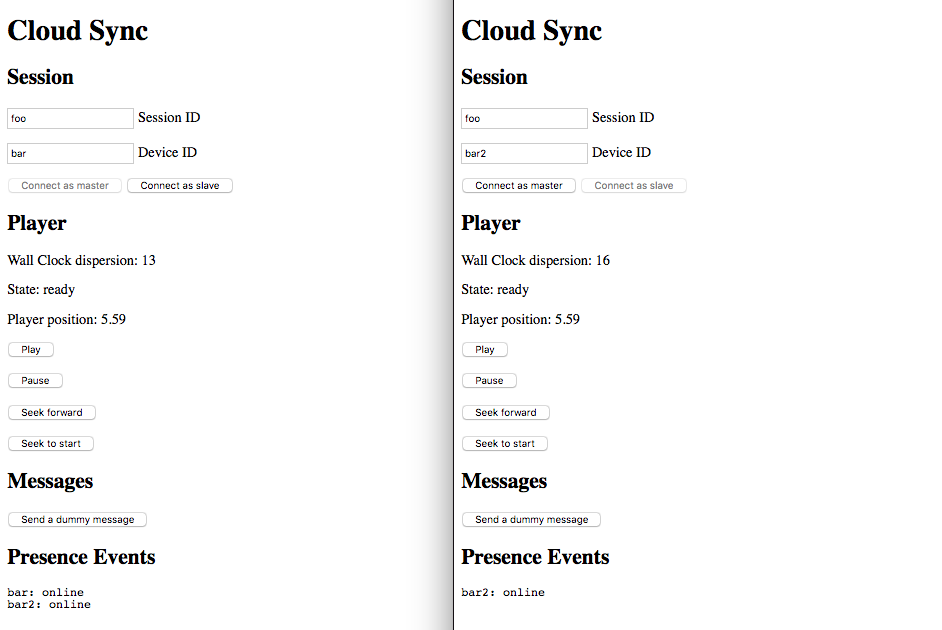

# cloud-sync-client example

This example shows the usage of the `sync` client using the `cloud-sync-adapter`.

## Setup

Make sure you've run `yarn link` in the `bbcat-orchestration` repository root to get the
development version of the library.

```
yarn install
yarn link bbcat-orchestration
yarn dev
```

## Usage

After running the development server (`yarn dev`), browse to [localhost:8080](http://localhost:8080).

Enter a common session id and a unique device id in two browser tabs. First press _connect as master_
in one, then _connect as slave_ in the other tab.

When the master connects, the audio should start playing immediately. You can use the playback controls
on the master to influence the synchronised player on both devices. Devices joining and leaving should
be logged in the _presence events_ section.

## Known Issues

* control buttons are displayed on slave device although they have no effect.

## Screenshot


