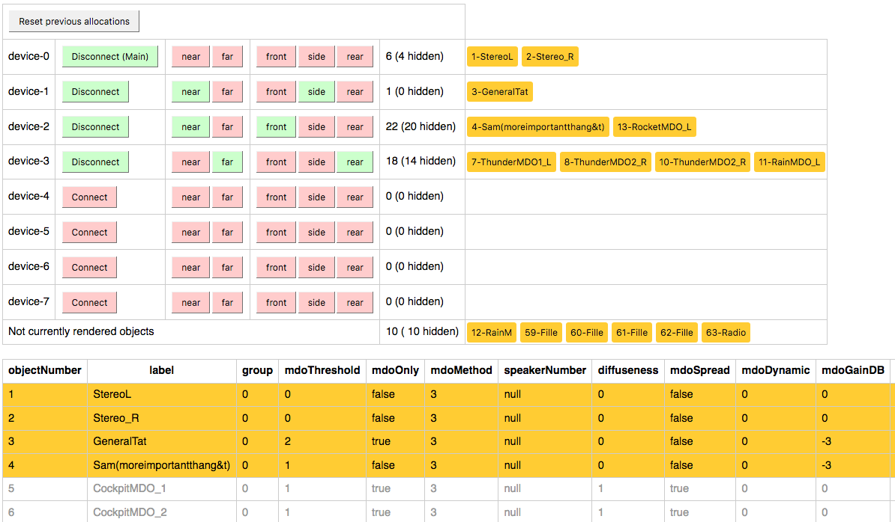

# MDO Allocation example

This example visualises the object allocations for a number of devices in specified locations.

It uses the `mdo-allocator` and the rule set defined therein, and reads the object definitions
including MDO metadata from `sequence.json` in this directory.

## Setup

Make sure you've run `yarn link` in the `bbcat-orchestration` repository root to get the
development version of the library.

```
yarn install
yarn link bbcat-orchestration
yarn dev
```

## Usage

After running the development server (`yarn dev`), browse to [localhost:8080](http://localhost:8080).

Use the red and green buttons to connect or disconnect auxiliary devices or set their locations. The
device table lists all objects rendered on each device.

Object placement does depend on the previous allocation, so use the Reset button at the top to
clear this memory and randomise the assignment where multiple devices of equal suitability exist
for an object.

The object table lists all metadata fields for all objects. By default all objects are shown in the
device table. Click an orange object to hide it, and a white object to show it again. Click the
table header row to hide or show all objects.

## Known Issues

* The allocation is only run when something changes, so set a (ignored) location on the
main device to see the allocation without any auxiliary devices.
* The number displayed with the _not currently rendered objects_ is sometimes incorrect.

## Screenshot


