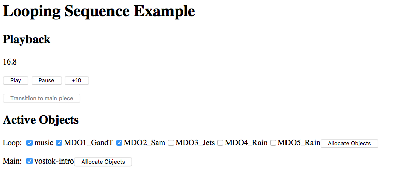

# sequence-renderer-loop example

This example shows the usage of the `SynchronisedSequenceRenderer` component to create a renderer that
plays a looping sequence with defined out-points, and transitions into a regular sequence.

## Setup

Make sure you've run `yarn link` in the `bbcat-orchestration` repository root to get the
development version of the library.

```
yarn install
yarn link bbcat-orchestration
yarn dev
```

## Usage

After running the development server (`yarn dev`), browse to [localhost:8080](http://localhost:8080).

Press _Play_ to start playing the loop sequence. You may adjust the objects rendered in each of
the sequences.

Press _Transition to main piece_ to disable all non-music objects in the loop, and transition at
the next out-point.

The sequences are defined in `loop.json` and `intro.json` in this directory.

## Known Issues

* 

## Screenshot



