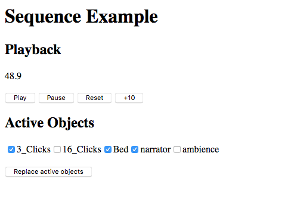

# sequence-renderer example

This example shows the usage of the 

## Setup

Make sure you've run `yarn link` in the `bbcat-orchestration` repository root to get the
development version of the library.

```
yarn install
yarn link bbcat-orchestration
yarn dev
```

## Usage

After running the development server (`yarn dev`), browse to [localhost:8080](http://localhost:8080).

Press _Play_ to start playing the media. Select a number of objects and click _replace active objects_
render your selection.

The sequence is defined in `sequence.json` in this directory.

## Known Issues

* ...

## Screenshot


