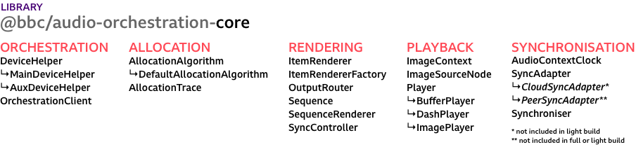

# audio-orchestration-core

This package provides the core components for building orchestrated audio experiences. This core library is used in the [template application](../template).

## Overview

An orchestrated audio experience consists of one or more **sequences**, each described by a metadata file listing the available **audio objects**. Each **audio object** can have any number of **behaviours** which are interpreted by an **allocation algorithm** to determine the rendering, given information about connected devices. There is a single **main device** and any number of **aux devices** per **session**, synchronising to a **cloud-sync server** and using this to communicate with each other.

* The **main device** generates a **pairing code**, registers a session with the **cloud-sync server**, runs the **allocation algorithm**, and keeps track of any connected **aux devices** and metadata about them.
* The **aux devices** join a session identified by the **pairing code**, send information about themselves including any **control values**, and receive their **allocations** from the **main device**.
* Any device can play back the synchronised audio tracks specified in the sequence metadata.

The [template application](../template) has some examples of the required metadata and shows how this library can be used to build a complete experience. While it is possible to write sequence metadata by hand, we generally recommend using [_Audio Orchestrator_](https://www.bbc.co.uk/makerbox/tools/audio-orchestrator) to author behaviours and package the audio files in the expected format.

## Components



* [orchestration](./src/orchestration):
  The `OrchestrationClient` connects up all other required components for a standard setup with one main and many aux devices, and multiple sequences and controls.
* [allocation](./src/allocation):
  The `AllocationAlgorithm` interprets device metadata and object behaviours to generate the allocations used by the renderer on each device.
* [rendering](./src/rendering):
  The `SequenceRenderer` interprets the `Sequence` metadata, creates audio player instances, and connects them to the `SyncController`.
* [playback](./src/playback):
  The `BufferPlayer`, `DashPlayer`, and `ImagePlayer` implement a common interface for playback of different types of media items.
* [synchronisation](./src/synchronisation):
  The `Synchroniser` uses a `SyncAdapter` to connect to a synchronisation service. It provides methods for getting a synchronised wall clock, sharing timeline objects, and passing messages to other devices.

## Usage

The distribution for this package includes files to support different use cases: a `full` and a `light` build of the core library, as well as two standalone adapters for using the `light` build with different synchronisation servers. It is also possible to write your own adapter to support other backends.

The `full` build includes everything in the `light` build, as well as the `CloudSyncAdapter` - so you'll need nothing else if you want to use Cloud-Sync.

```js
import { orchestration } from '@bbc/audio-orchestration-core/full';
const client = new orchestration.OrchestrationClient({
  // example endpoint for a local Cloud-Sync service
  syncEndpoint: { hostname: 'localhost', port: '9001' },
});
```

The `light` build  does not include any synchronisation adapter. You can import and use an alternative sync adapter provided as part of the distribution, such as the `PeerSyncAdapter`.

```js
import { orchestration } from '@bbc/audio-orchestration-core/light';
import { PeerSyncAdapter } from '@bbc/audio-orchestration-core/peerSyncAdapter';

const client = new orchestration.OrchestrationClient({
  syncAdapterClass: PeerSyncAdapter,
  // peer.js defaults to a public server address, so all endpoint settings are optional
  syncEndpoint: {
    // host: 'example.com',
    // port: 9000,
    // path: '/',
    // key: 'orchestration',
    // config: {
    //   iceServers: [
    //     { url: `stun:stun.example.com:3478` },
    //     { url: `turn:turn.example.com:3478`, username: 'orchestration', credential: 'orchestration' },
    //   ],
    // }
  },
});
```

You might instead like to implement your own sync adapter, by extending the `SyncAdapter` base class. See the [SyncAdapter source code](./src/synchronisation/SyncAdapter.js) for a description of the interface.

```js
import { orchestration, synchronisation } from '@bbc/audio-orchestration-core/light';

class MySyncAdapter extends synchronisation.SyncAdapter {
  // ...
}

const client = new orchestration.OrchestrationClient({
  syncAdapterClass: MySyncAdapter,
  syncEndpoint: {},
});
```

It is also possible to use the library without a JavaScript bundler, by referencing e.g. `dist/audio-orchestration.full.js` using a `<script>` tag. In this case, the exports will be available on the global `audioOrchestration.full` object (and `audioOrchestration.light`, `audioOrchestration.peerSyncAdapter` respectively).

```html
<script src="dist/full.js"></script>
<script>
  const { orchestration } = audioOrchestration.full;
  const client = new orchestration.OrchestrationClient(/* ... */);
</script>
```

## Development

`npm run dev` creates a development build and re-runs on changes to the source.

`npm run build` creates a production build of the complete library in `dist/`.

`npm run lint` checks for coding style violations.

`npm run test` runs tests for the allocation algorithm implementation.

`npm run doc` generates class documentation in `docs/index.html`.


## Use in the template

Our [audio orchestration template](../template) application is an example of using this library in a _React_ application to play multiple _sequences_, use _controls_ to feed into the allocation algorithm, and display device and object allocation metadata. It only needs to interact with the `OrchestrationClient` component, as this sets up all the other components.

## Extending the allocation algorithm

See also: the [allocation algorithm](https://bbc.github.io/bbcat-orchestration-docs/allocation-algorithm/) is introduced in the _Audio Orchestrator_ documentation.

When creating an `OrchestrationClient`, you can optionally provide in an instance of the allocation algorithm to use. The `AllocationAlgorithm` provides the `registerBehaviour` method. This is how all the standard behaviours are added in the `DefaultAllocationAlgorithm`, and can also be used on instances of these classes without creating a new class. See the [behaviour definitions](src/allocation/behaviours) for the function definitions for the standard behaviours.

```js
import { DefaultAllocationAlgorithm, OrchestrationClient } from '@bbc/audio-orchestration-core';

const myAlgorithm = new DefaultAllocationAlgorithm();
myAlgorithm.registerBehaviour('myBehaviour', ({
  behaviourParameters,
  object,
  objects,
  devices,
  previousAllocations,
  session,
  allocations,
  deviceFlags,
}) => {
  // See the standard behaviour functions for what you can do here
  return {};
});

const client = new OrchestrationClient({
  allocationAlgorithm: myAlgorithm,
  // other options...
});
```

Of course, you can also provide a completely different allocation algorithm, as long as it has an `allocate` method with a compatible signature and return value format.

## Examples

A number of stand-alone examples are provided to illustrate the usage of certain individual components.

 * [players](examples/players/): DASH and buffer source audio players
 * [cloud-sync-client](examples/cloud-sync-client/): connection to the Cloud-Sync service
 * [sequence-renderer](examples/sequence-renderer/): rendering a synchronised sequence using Cloud-Sync
 * [sequence-renderer-loop](examples/sequence-renderer-loop/): rendering a looping sequence
 * [mdo-allocation-explainer](examples/mdo-allocation-explainer/): interface for pasting a metadata file and stepping through the allocation algorithm steps
 * [sequence-visualiser](examples/sequence-visualiser/): shows the timings of audio objects included in a metadata file
 * [latency-calibration](examples/latency-calibration/): shows how compensating for the output latency of a device can improve synchronisation

## License and contributions

> @bbc/audio-orchestration-core
> Copyright (C) 2022 BBC R&D

See the [LICENSE](./LICENSE) file for terms applicable to this package, and the top-level [Readme](../../Readme.md) file for further information.
