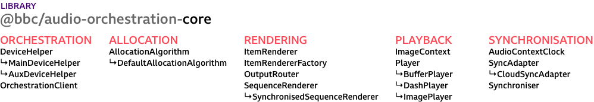

# audio-orchestration-core

This package provides the core components for building orchestrated audio experiences. This core library is used in the [template application](../template) included with our production tool, [Audio Orchestrator](https://www.bbc.co.uk/makerbox/tools/audio-orchestrator).

## Components



## Overview

An orchestrated audio experience consists of one or more **sequences**, each described by a metadata file listing the available **audio objects**. Each **audio object** can have any number of **behaviours** which are interpreted by an **allocation algorithm** to determine the rendering, given information about connected devices. There is a single **main device** and any number of **aux devices** per **session**, synchronising to a **cloud-sync server** and using this to communicate with each other.

* The **main device** generates a **pairing code**, registers a session with the **cloud-sync server**, runs the **allocation algorithm**, and keeps track of any connected **aux devices** and metadata about them.
* The **aux devices** join a session identified by the **pairing code**, send information about themselves including any **control values**, and receive their **allocations** from the **main device**.
* Any device can play back the synchronised audio tracks specified in the sequence metadata.

The [template application](../template) has some examples of the required metadata and shows how this library can be used to build a complete experience. While it is possible to write sequence metadata by hand, we generally recommend using [Audio Orchestrator](https://www.bbc.co.uk/makerbox/tools/audio-orchestrator) to author behaviours and package the audio files in the expected format.

The following diagram shows the internal components of the core library.


* [sync-players](src/sync-players/):
  Audio players with synchronisation based on `bbcat-js` DASH and buffer sources, and a
  sync-controller to lock them to a timeline clock.
* [sync](src/sync/):
  Wrapper for communicating with different synchronisation and message exchange services. Currently
  implements an adapter for the `cloud-sync` service.
* [mdo-allocator and mdo-receiver](src/mdo-allocation/):
  A rule set for allocating individual objects to synchronised devices, based on knowledge about
  available objects and devices. The allocator runs on the main device, the receiver on auxiliary
  devices.
* [sequence-renderer](src/sequence-renderer/):
  A renderer for managing playback of multiple audio sources scheduled on a synchronised timeline.
* [orchestration-client](src/orchestration/):
  A single class managing all the above components to expose a single interface. Mainly manages the
  multi-step setup process, provides user input methods, and exposes state-change events.

## Usage

The available exports are listed in [index.js](src/index.js). If the library is installed using `npm`, it can be imported like this:

```js
import { OrchestrationClient } from '@bbc/audio-orchestration-core';
```

It is also possible to import the bundled library (`dist/bbcat-orchestration.js`) using a `<script>` tag. In this case, the exports are available on the global `bbcatOrchestration` object.

```html
<script src="bbcat-orchestration.js"></script>
<script>
  const { OrchestrationClient } = bbcatOrchestration;
</script>
```

## Development

`npm run dev` creates a development build, `npm run build` creates a production build of the complete library in `dist/`.

`npm run lint` checks for coding style violations.

`npm run test` runs tests for the allocation algorithm implementation.

`npm run doc` generates class documentation in `docs/index.html`.


## Use in the template

Our [audio orchestration template](../template) application is an example of using this library in a _React_ application to play multiple _sequences_, use _controls_ to feed into the allocation algorithm, and display device and object allocation metadata. It only needs to interact with the `OrchestrationClient` component, as this sets up all the other components.

## Extending the allocation algorithm

See also: the [allocation algorithm](https://bbc.github.io/bbcat-orchestration-docs/allocation-algorithm/) is introduced in the _Audio Orchestrator_ documentation.

When creating an `OrchestrationClient`, you can optionally provide in an instance of the allocation algorithm to use. The `AllocationAlgorithm` provides the `registerBehaviour` method. This is how all the standard behaviours are added in the `DefaultAllocationAlgorithm`, and can also be used on instances of these classes without creating a new class. See the [behaviour definitions](src/allocation-algorithm/behaviours) for the function definitions for the standard behaviours.

```js
import { DefaultAllocationAlgorithm, OrchestrationClient } from '@bbc/audio-orchestration-core';

const myAlgorithm = new DefaultAllocationAlgorithm();
myAlgorithm.registerBehaviour('myBehaviour', ({
  behaviourParameters,
  object,
  objects,
  devices,
  previousAllocations,
  session,
  allocations,
  deviceFlags,
}) => {
  // See the standard behaviour functions for what you can do here
  return {};
});

const client = new OrchestrationClient({
  allocationAlgorithm: myAlgorithm,
  // other options...
});
```

Of course, you can also provide a completely different allocation algorithm, as long as it has an `allocate` method with a compatible signature and return value format.

## Examples

A number of stand-alone examples are provided to illustrate the usage of certain individual components:

 * [players](examples/players/) DASH and buffer source audio players
 * [cloud-sync-client](examples/cloud-sync-client/) connection to the cloud-sync service
 * [sequence-renderer](examples/sequence-renderer/) rendering a synchronised sequence using cloud-sync
 * [sequence-renderer-loop](examples/sequence-renderer-loop/) rendering a looping sequence
 * [mdo-allocation-explainer](examples/mdo-allocation-explainer/) interface for pasting a metadata file and stepping through the allocation algorithm steps
 * [sequence-visualiser](examples/sequence-visualiser/) shows the timings of audio objects included in a metadata file
 * [latency-calibration](examples/latency-calibration/) shows how compensating for the output latency of a device can improve synchronisation

