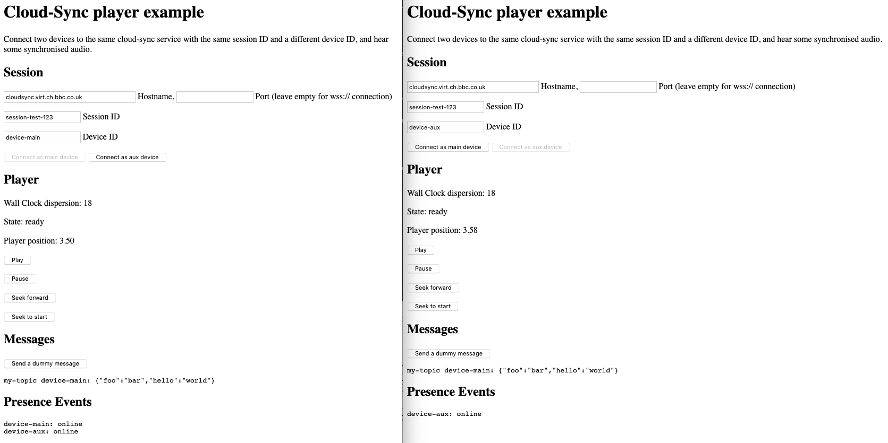

# cloud-sync-client example

This example shows the usage of the `sync` client using the `cloud-sync-adapter`.

## Usage

```
npm install
npm run dev
```

After running the development server (`npm run dev`), browse to [localhost:8080](http://localhost:8080).

Enter a common session id and a unique device id in two browser tabs. First press _connect as main_
in one, then _connect as aux_ in the other tab.

You may also change the cloud-sync server by entering hostname and port in these formats:

 * hostname only: will be interpreted as a secure websockets connection on the default HTTPS port;
   despite the name the field may include a pathname (but not a protocol prefix) e.g. `cloud-sync.example.com/cloud-sync`.
 * hostname and port: will be interpreted as a regular websockets connection on the specified port
   (usually only needed when running a cloud-sync server locally).

When the main device connects, the audio should start playing immediately. You can use the playback
controls on the main device to control the synchronised player on both devices. Devices joining and
leaving should be logged in the _presence events_ section.

## Known Issues

 * control buttons are displayed on aux device although they have no effect.

## Screenshot


