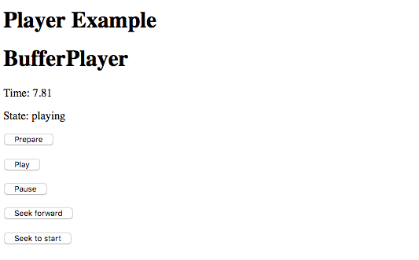

# Players example

This example shows the usage of the `dash-player` and `buffer-player` components.

## Usage

```
npm install
npm run dev
```

After running the development server (`npm run dev`), browse to [localhost:8080](http://localhost:8080).

Choose to initialise a DASH or Buffer player (reload the page to reset the choice), then click
_Prepare_ and wait for it to change state to `ready`. Use the _Play_, _Pause_, and _Seek_ controls
to control the player.

## Known Issues

These issues are with the implementation of the player components, not this example.

 * Buffer Player: Play after pausing continues from beginning or last seek target, not from where
   it was paused.
 * DASH Player: Pause does not affect the display time. Play continues from last seek target.

## Screenshot


