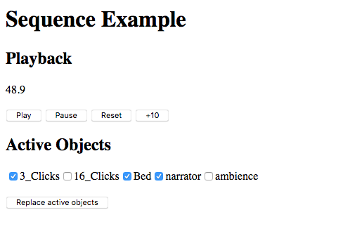

# sequence-renderer example

This example shows the usage of the `SynchroniseSequenceRenderer` component.

## Usage

```
npm install
npm run dev
```

After running the development server (`npm run dev`), browse to [localhost:8080](http://localhost:8080).

Press _Play_ to start playing the media. Select a number of objects and click _replace active objects_
render your selection.

The sequence is defined in `sequence.json` in this directory.

## Known Issues

* ...

## Screenshot


