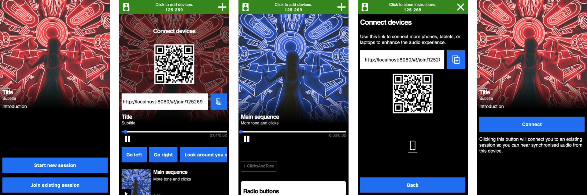

# Audio orchestration template

This project is a user interface template built with the [@bbc/audio-orchestration-core library](../core) library. It is a starting point for developing additional features.

This template is also used by [Audio Orchestrator](https://www.bbc.co.uk/makerbox/tools/audio-orchestrator) to preview and export a prototype application. The [documentation](https://bbc.github.io/bbcat-orchestration-docs/custom-template) explains how to use a custom build of this template.

Audio Orchestrator is used to combine this template with encoded audio and metadata files.



## Usage

Make sure you have installed and built the dependencies by running `npm install` and `npm run build -ws` in the repository root (_not_ this `template` folder).

Run the development server:

```sh
npm run dev
```

The build will be hosted at http://localhost:8080 and automatically refresh on most changes to the source code.

If you are not using the template with _Audio Orchestrator_, you may have to set up your synchronisation server. Instructions on how to do this are given in the [Cloud Sync repository](https://github.com/bbc/cloud-sync). Configure the template with the server address by uncommenting and editing one of the examples for the `SYNC_ENDPOINT` option in `src/index.html`. Reload the page in your browser to apply any changes to the configuration.

## Adding media and metadata

Audio _sequences_ are added by copying their metadata and audio files to the `audio/` directory (which is copied to `dist/audio` as part of the build process) and registering them in the configuration object in `src/index.html`. Both of those steps are usually done using _Audio Orchestrator_, but the example files included with this repository indicate the expected layout and syntax.

## Development

This section introduces the key components of the template application, intended for developers looking to customise it or add features beyond those that can be configured in Audio Orchestrator.

### Recommended reading

The following libraries are used in the template, and their documentation may be useful when looking to make changes.

* [React.js](https://reactjs.org/)
* [Redux](https://redux.js.org/) (and [react-redux](https://redux.js.org/basics/usagewithreact))
* [Redux-saga](https://redux-saga.js.org/)
* [@bbc/audio-orchestration-core](../core)

### Important places

When you build (`npm run build`) the template, a `dist/` folder including all assets needed to publish the experience, including JavaScript and CSS bundles and a copy of all audio files and images, is created.

The template is a React application instantiated in the `<script>` tag in `index.html`, which calls the `initOrchestrationTemplate` function defined in [index.js](./src/index.js) with the target DOM element and the experience configuration object.  Available configuration keys are defined in [config.js](./src/config.js).

The React app's root component is in [App.jsx](./src/App.jsx), this imports all the available _pages_. Each page is a React component (in [pages/](./src/pages)).

Application state is managed using _Redux_ and _Redux-Saga_. The _sagas_ ([sagas.js](./src/sagas.js)) define the flow through different application states (such as navigating between pages, waiting for a connection, validating user input). The _reducer_ ([template/reducer.js](./src/template/reducer.js)) receives _actions_ dispatched by React components or the sagas to update the application state.

The orchestration client instance is created in [template/orchestration.js](./src/template/orchestration.js), where we also register event handlers that can update the application state by dispatching actions. Note that there is a similar file, ([template/calibrationOrchestration.js](./src/template/calibrationOrchestration.js), which manages a second orchestration session for use with calibration mode.

All user interface components are defined with (at least) a `.jsx` (React component) file and an `.scss` (style) file in [components/](./src/components). For the most recently written components we prefer using React Redux hooks (`useSelector`) in the component itself to access the state; however some components still use `mapStateToProps` functions defined in a `Connected<Component>.jsx` instead. When adding a new component, take care to also import the `.scss` file in `index.js`.

## Licence and contributions

> @bbc/audio-orchestration-template
> Copyright (C) 2021 BBC R&D

See the [LICENSE](./LICENSE) file for terms applicable to this package, and the top-level [Readme](../../Readme.md) file for further information.
