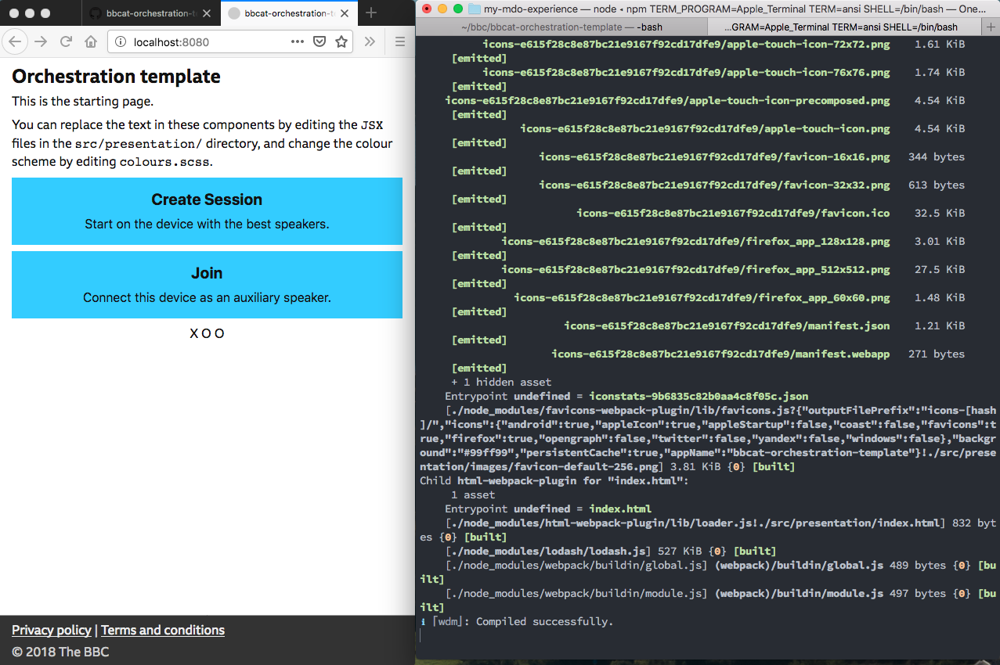
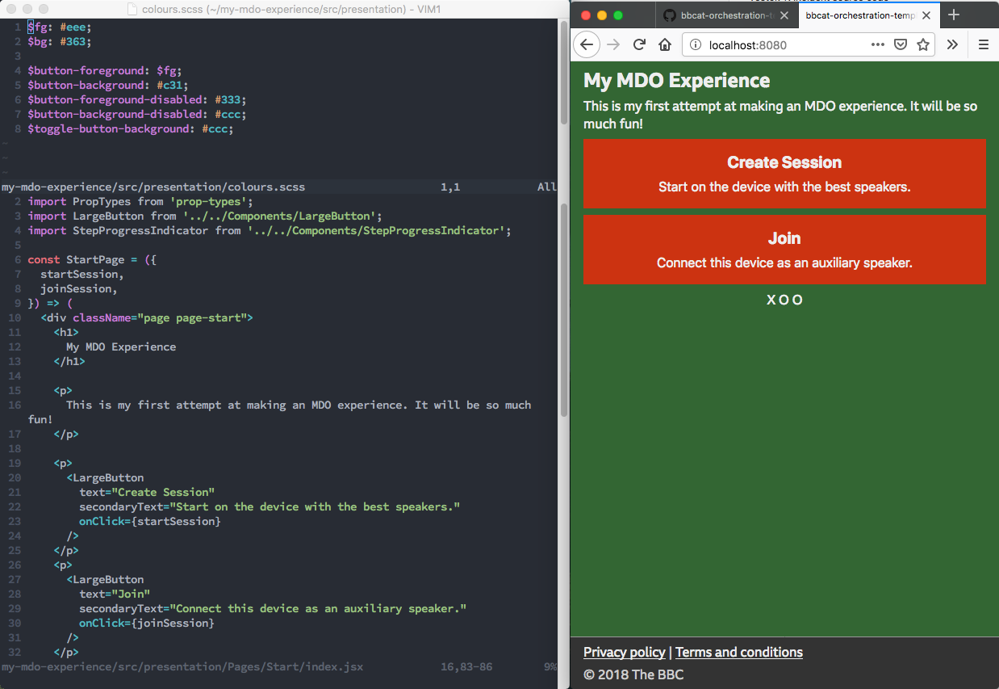

# Tutorial

_Use the bbcat-orchestration-template to create orchestrated audio experiences._

This template is an example user interface using the
[bbcat-orchestration](https://github.com/bbc/bbcat-orchestration) tools for orchestrated 
object-based audio experiences running in the web browser. Any device -- phone, tablet,
laptop -- with a modern browser can become part of the surround sound experience. This technology,
Media Device Orchestration (MDO) uses the smart rendering rules described in
[AES e-brief 461](http://www.aes.org/e-lib/browse.cfm?elib=19726) to decide which device should
play back each audio object. This template was used to deliver the
[Vostok-K Incident](https://github.com/bbc/rd-audio-vostok/) on
[BBC Taster](https://www.bbc.co.uk/taster/pilots/vostok): it was extended and customised a lot for
this audience-facing pilot. Variable length content is not considered here, object-based audio is
interpreted purely as turning individual channels or tracks on or off and routing them to different
loudspeakers.

Following this tutorial, you will create your own MDO content using a digital audio workstation of
your choice. The metadata can be authored in a spreadsheet or text editor in lieu of the
[S3A](http://www.s3a-spatialaudio.org) plugins (yet to be published). You will learn how to use
the provided scripts to encode the audio in the correct format, and how to listen to it in the
rudimentary interface provided by this template. The text, colour scheme, and images in the template
can be easily replaced to make it your own, but prior web development experience (React, Redux) is
required to make as far reaching changes as those done for the _Vostok_ pilot.

## Requirements

You'll need a few things to make this work.

You should be able to export the logical audio objects from your digital audio workstation (DAW)
into individual mono wav files.

You'll also need a spreadsheet or text editor that can export to plain-text `csv` files (e.g.
Microsoft Excel or Google Docs) to create the metadata table.

This template is written mostly in JavaScript, and you'll need `nodejs` to compile it before you
can view it in the browser. You'll also need `ffmpeg` and `python3` to encode the media and convert
the metadata files. We recommend you use `git` to checkout this repository.

Installation of the Node modules might also prompt for a JDK, unfortunately this is currently required
to get it to install; a future version of this template should remove that dependency.

_These instructions assume you're on a Mac and comfortable installing software using homebrew.
Other operating systems and installation methods are available, but the required steps might
differ slightly._

## Create your working copy of the template

Make sure `node` is installed. If you use Homebrew, it can be installed with `brew install node`,
or via the link below:

* [Node.js](https://nodejs.org/en/)

Create a new Git repository, change into the directory, and pull in the latest version of the template.  

```sh
git init my-mdo-experience
cd my-mdo-experience
git pull git@github.com:bbc/bbcat-orchestration-template.git
```

This creates a local _fork_ of the template you can then build on, that is not linked to this GitHub
repository.

Then, install all the Node.js dependencies and build tools.

```sh
yarn install
```

The dependencies defined in `package.json` (and their dependencies) are installed into the
`node_modules` directory. This may take a few minutes the first time around.

You can now start the development server included with the template.

```sh
yarn dev
```

The `dev` script uses the `webpack` and `babel` tools to transpile the template and library
JavaScript code and package it all up nicely with the images and stylesheets, ready for the
browser to use. The development server also watches for changes, so it rebuilds and reloads
the page when you change a file. When it says _Compiled successfully_ you can open your
browser at [localhost:8080](http://localhost:8080) to see it.



## Customise the text and colour scheme

Well done! You now have a local copy of the template that you can modify as you like.

The page should automatically reload a few seconds after you save the files.

For example, try changing the title on the front page by editing `src/presentation/Pages/Start/index.jsx`
in a text editor. The bits in the JSX files that look like HTML are usually safe to edit; and your
text editor will have an undo button, so experiment!

You can also change the button colours by editing `src/presentation/colours.scss`.



## Prepare your audio files and metadata table

The audio for each object must be prepared as a mono `.wav` file. Note that even left and right
legs of a stereo track should be exported as separate mono objects. As common in digital audio
workstation exports, all these files should be the same length. Place all these `.wav` files in
one directory.

The metadata table lists all objects, and for each includes fields instructing the system where to
place the object. This can be generated from production metadata you may already have, or created
manually in a spreadsheet editor like Microsoft Excel. Either way, a number of columns must be added
to the plain MDO metadata, to link the object data to the exported files, and identify the left and
right files for any stereo objects.

Here is the header row for the metadata table. Below this, add a row for every object:

```csv
objectNumber,panning,filename,mdoObjectLabel,image,mdoThreshold,mdoOnly,mdoSpread,muteIfObject,exclusivity,nearFront,nearSide,nearRear,farFront,farSide,farRear,above,onDropin,onDropout,minQuality
```

In addition to the data produced by the S3A plugin, you will need to fill in the filename and panning
(30 for left, -30 for right) columns. Note that the script currently expects the filename to be the
third column. For other columns, the labels in the first row are used so their order matters less.
An example file that can be edited in Excel is provided in [example-loop.csv](example-loop.csv).
When saving from Excel, select _Comma Separated Values(.csv)_ as the file format.

Place the `.csv` file in the same directory as the audio `.wav` files.

## Install and run the packaging tools

The scripts used to package your audio and metadata are included in the
[bbcat-orchestration repository](https://github.com/bbc/bbcat-orchestration) repository.

Clone the `bbcat-orchestration` repository to get the scripts and `cd` into it:

```sh
git clone git@github.com:bbc/bbcat-orchestration.git
cd bbcat-orchestration
```

The following tools and utilities are required: `python3` and `ffmpeg` with the fdk
AAC encoder, and the `parallel` utility. You should already have `node` from the
previous section. Here's how to install any that may be missing using Homebrew (if you already
have working versions of the tools, you don't need to run these):

```sh
brew install python # probably already installed
brew install ffmpeg --with-fdk-aac
brew install parallel
brew install node # already installed in previous step
```

Now set up a `python3` virtual environment named `env` in `tools/split-tracks`, activate it, and
install the python dependencies:

```sh
cd tools/split-tracks
python3 -m venv env
. env/bin/activate
pip install numpy
pip install pandas
pip install pysndfile
cd ..
```

_NB: See the troubleshooting notes below if `pysndfile` installation fails._

Now that we have all the tools, and the metadata and audio files in one place, we can run the 
packaging script. The arguments to it are: the path to the `.csv` metadata file, the path to
where the results should be stored, and the public path where they will appear on the web server.

Assuming your audio is stored in `~/my-mdo-audio/` and you've created your repository in
`~/my-mdo-experience`, this command would look like this:

```sh
./prepare.sh ~/my-mdo-audio/metadata.csv ~/my-mdo-experience/audio/my-mdo-audio audio/my-mdo-audio
```

Depending on the number and duration of audio objects, this may take a few minutes. Two sets of
files are created, in the `headerless` and `safari` directories within the output directory you
specified.

## Configure the application to use your audio

We are going to replace the initial audio, the loading loop, with the new audio we have just
packaged up.

Open `src/config.js` (in your `~/my-mdo-experience/` repository) in a text editor, and change the
`SEQUENCE_LOOP` URL setting to point to the new metadata files created in the previous section:

```javascript
const SEQUENCE_LOOP = isSafari ? 'audio/my-mdo-audio/safari/sequence.json' : 'audio/my-mdo-audio/headerless/sequence.json';
```

To set the sequence to actually loop, edit both `sequence.json` files and set the `loop` value to
`true`. You may also want to define custom `outPoints`, which define the time in seconds since the
start where the system may transition away from the sequence to move to the main content. If you
don't define these, it will cut about a second after you press the button to continue.

```json
{
  "duration": 29.03998,
  "loop": true,
  "outPoints": [
    2.1,
    4.4,
    5.7,
    9.3,
    11.6,
    14.6,
    19.0,
    21.0,
    25.3,
    29.0
  ],
  "objects": [
  ...
  ]
}
```

When you now go back to your browser (you might have to CTRL-C and restart the `yarn dev` process)
and start a session, you should hear your new audio.

## Add per-object images

Each object in your metadata table can have an `image` property. This is a short identifier to
reference the image later, not a file name.

Images are stored in `src/presentation/images` and the mapping from name to file is defined in
the `src/presentation/images.scss` file. Register your images there: for example, to add one
referred to as `my-object-image` in the metadata file, add the following line to the end of
`images.scss`:

```css
.player-image-my-object-image { background-image: url('./images/my-object-image.png'); }
```

This defines a CSS class referencing your image file as a background image. Images are assumed to
be square and around 400 by 400 pixels in size. The class name always begins with `.player-image-`,
and ends with the name you defined in the metadata table's image column.

## Troubleshooting

* `pip install pysndfile` may fail if the `sndfile` headers are not found on the system. In this case,
  get them with e.g. `brew install libsndfile`.
  * As of version 1.3.2, `pysndfile` does not seem to be compatible with Python 3.7 (MacOS High Sierra default). The last known working Python version is 3.6. A different method of generating the audio and metadata files is being developed currently (May '19).
* Python installed via _Anaconda_ may cause errors during `yarn install` process. In this case, the
  system python (`python` command) should be set to Python 2, and the `$PYTHON_HOME` environment
  variable may also need to be adjusted to match this setting.
